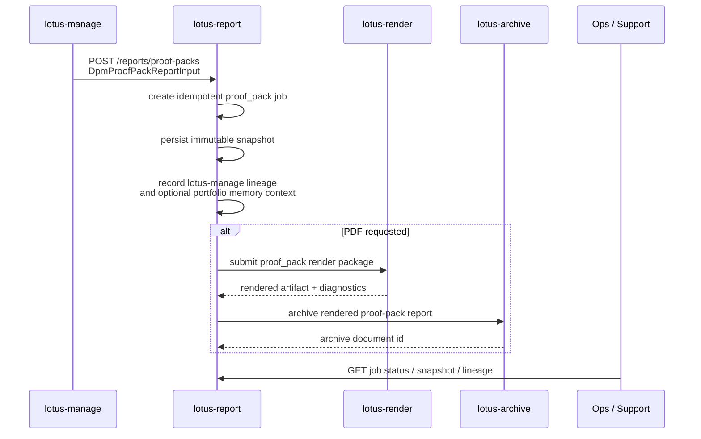

# Proof-Pack Report

## Purpose

`POST /reports/proof-packs` materializes a manage-owned `DpmProofPackReportInput` into a governed
report job. It is the first-wave `lotus-report` implementation for RFC40-WTBD-004 and exists so a
pre-trade DPM proof pack can move through the same durable report, render, and archive lifecycle as
other governed report artifacts.

This endpoint is not a proof-pack engine. `lotus-manage` remains the source of proof-pack evidence,
supportability, source hashes, and decision facts. `lotus-report` persists the bounded handoff,
records lineage, builds the render package, and orchestrates render/archive state transitions.
Missing source hashes, source evidence refs, redaction policy, retention policy, or supportability
posture are rejected before durable capture; `lotus-report` does not create complete snapshots or
render packages with placeholder lineage. When `lotus-manage` supplies bounded
`portfolio_memory_context`, `lotus-report` carries the event identity, memory and context content
hashes, support boundary, event-ref limit/selection/returned/omitted/truncated posture, per-ref
event time/rank, supportability, retention, redaction, access, and audit posture into snapshot
lineage and render-package lineage without reconstructing portfolio-memory events.

## Business Flow

## Current Feature Coverage

| Capability | Current state |
| --- | --- |
| Job initiation | `POST /reports/proof-packs` with required `Idempotency-Key` and governed caller context headers |
| Source input | Typed manage-owned `DpmProofPackReportInput` supplied as `proof_pack_report_input`; source hashes, evidence ref, redaction, retention, and supportability posture are required |
| Portfolio memory context | Optional Manage-owned `portfolio_memory_context` carried as bounded lineage only, including context hash and event-ref selection/truncation posture when supplied |
| Snapshot | Immutable `report_input_snapshot` row with contract `dpm_proof_pack_report_input.v1` |
| Lineage | Append-only upstream-call evidence to `lotus-manage` proof-pack report-input source plus portfolio-memory content hash, bounded context hash, and truncation posture when supplied |
| Render package | `report_type=proof_pack`, `template_id=proof-pack`, `template_version=v1` |
| Archive handoff | Reuses the existing report-to-archive lifecycle after successful PDF render |
| Status and support | Existing job status, event, snapshot, lineage, and diagnostics endpoints |

## Non-Functional Posture

- Idempotency is enforced by the report request ledger and deterministic request hash.
- Snapshot payloads remain durable and hashable; support endpoints avoid leaking raw upstream
  internals beyond governed snapshot lookup.
- Portfolio-memory context is treated as lineage, not as an instruction to derive missing
  proof-pack, risk, performance, mandate, execution, tax, cash, FX, report, or AI facts.
- Correlation and trace identifiers are preserved through snapshot, render, and archive handoff.
- Render determinism is bounded by `lotus-render` runtime-envelope fingerprinting.
- Archive retrieval, retention execution, legal hold, purge, and access-audit execution remain
  `lotus-archive` responsibilities.

## Ownership Boundary

| Concern | Owner |
| --- | --- |
| Proof-pack source evidence and supportability | `lotus-manage` |
| Portfolio-memory event identity, retention, redaction, access, and audit policy | `lotus-manage` |
| Report job ledger, snapshot, lineage, render package, archive handoff | `lotus-report` |
| PDF execution and render diagnostics | `lotus-render` |
| Archived document identity, retention, legal hold, retrieval, purge, access audit | `lotus-archive` |

## Validation Evidence

Implementation-backed tests cover:

- proof-pack request ledger creation and idempotent identity fields,
- required proof-pack portfolio and as-of validation,
- proof-pack render-package contract shape and fallbacks,
- optional portfolio-memory lineage propagation without proof-pack fact reconstruction,
- `/reports/proof-packs` snapshot capture and lineage lookup,
- PDF request handoff to the render orchestration service.
