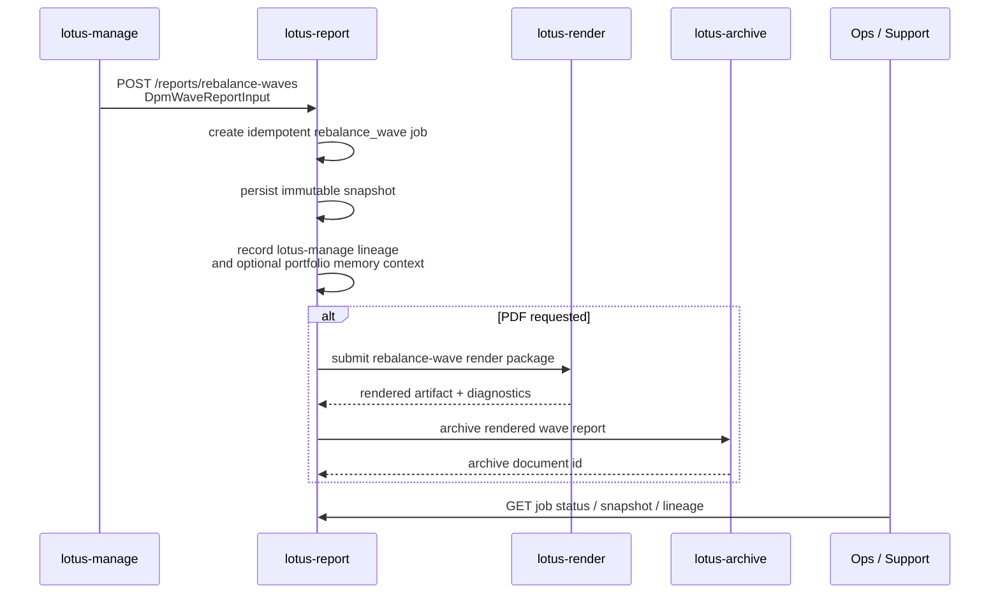

# Rebalance Wave Report

## Purpose

`POST /reports/rebalance-waves` materializes a manage-owned `DpmWaveReportInput` into a governed
report job. It is the first-wave `lotus-report` implementation for RFC41-WTBD-008 and lets a DPM
rebalance wave move through the same durable report, render, and archive lifecycle as portfolio,
outcome-review, and proof-pack artifacts.

This endpoint is not a wave engine. `lotus-manage` remains the source of wave state, item posture,
proof-pack linkage, supportability, source refs, and internal operations handoff evidence.
`lotus-report` persists the bounded handoff, records lineage, builds the render package, and
orchestrates render/archive state transitions. Missing source hashes, source evidence refs,
redaction policy, retention policy, or supportability posture are rejected before durable capture;
`lotus-report` does not create complete snapshots or render packages with placeholder lineage.
When `lotus-manage` supplies bounded `portfolio_memory_context`, `lotus-report` carries the event
identity, content hash, supportability, retention, redaction, access, and audit posture into
snapshot lineage and render-package lineage without reconstructing portfolio-memory events.

## Business Flow

## Current Feature Coverage

| Capability | Current state |
| --- | --- |
| Job initiation | `POST /reports/rebalance-waves` with required `Idempotency-Key` and governed caller context headers |
| Source input | Typed manage-owned `DpmWaveReportInput` supplied as `wave_report_input`; source hashes, evidence refs, redaction, retention, and supportability posture are required |
| Portfolio memory context | Optional Manage-owned `portfolio_memory_context` carried as bounded lineage only |
| Snapshot | Immutable `report_input_snapshot` row with contract `dpm_wave_report_input.v1` |
| Lineage | Append-only upstream-call evidence to `lotus-manage` wave report-input source plus portfolio-memory content hash when supplied |
| Render package | `report_type=rebalance_wave`, `template_id=rebalance-wave`, `template_version=v1` |
| Archive handoff | Reuses the existing report-to-archive lifecycle after successful PDF render |
| Status and support | Existing job status, event, snapshot, lineage, and diagnostics endpoints |

## Non-Functional Posture

- Idempotency is enforced by the report request ledger and deterministic request hash.
- Snapshot payloads remain durable and hashable; support endpoints expose evidence posture without
  raw source payloads or storage references.
- Portfolio-memory context is treated as lineage, not as an instruction to derive missing wave,
  proof-pack, risk, performance, mandate, execution, tax, cash, FX, report, or AI facts.
- Correlation and trace identifiers are preserved through snapshot, render, and archive handoff.
- Render determinism is bounded by `lotus-render` runtime-envelope fingerprinting.
- Archive retrieval, retention execution, legal hold, purge, and access-audit execution remain
  `lotus-archive` responsibilities.
- `external_execution_claimed` remains false until a separate OMS/execution owner is implemented
  and certified.

## Ownership Boundary

| Concern | Owner |
| --- | --- |
| Wave state, item posture, proof-pack linkage, supportability, source refs, internal handoff evidence | `lotus-manage` |
| Portfolio-memory event identity, retention, redaction, access, and audit policy | `lotus-manage` |
| Report job ledger, snapshot, lineage, render package, archive handoff | `lotus-report` |
| PDF execution and render diagnostics | `lotus-render` |
| Archived document identity, retention, legal hold, retrieval, purge, access audit | `lotus-archive` |

## Validation Evidence

Implementation-backed tests cover:

- wave request ledger creation and idempotent identity fields,
- required wave identity and as-of validation,
- wave render-package contract shape,
- optional portfolio-memory lineage propagation without wave fact reconstruction,
- `/reports/rebalance-waves` snapshot capture and lineage lookup,
- PDF request handoff to the render orchestration service.
